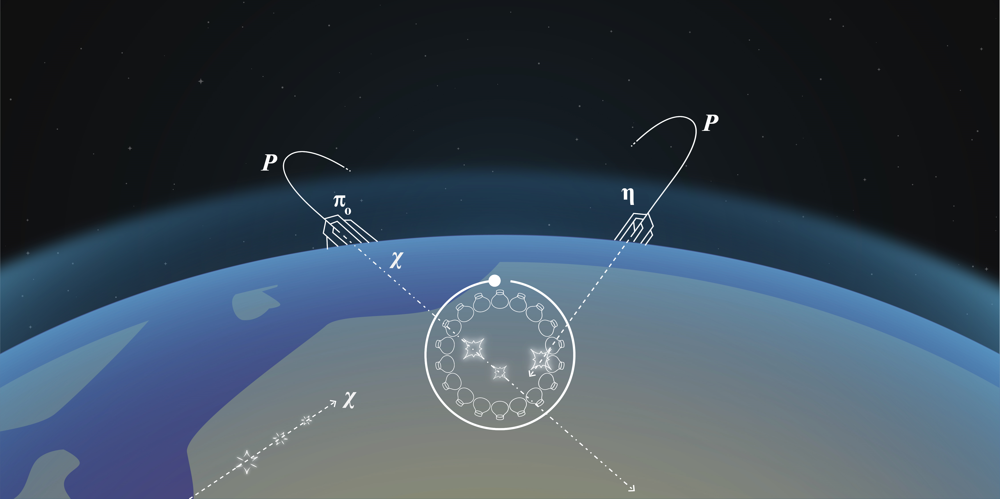

# Millicharged Particles From The Heavens

This is the digital appendix associated to the article:

### "Millicharged Particles From The Heavens: Single- and Multiple-Scattering Signatures"

Here is the link to the [arXiv version](https://arxiv.org/abs/2104.13924) .

Run the **Make_Plots.ipynb** notebook to reproduce some of the plots found in our paper!

-Relevant data used for this work can be found in the **Data** folder.

-Relevant code used for most of the calculations can be found in the **Scripts** folder.

For questions, contact any of the three authors:

Carlos A. Arguelles: carguelles@fas.harvard.edu \\
Kevin J. Kelly: kkelly12@fnal.gov \\ 
Víctor M. Muñoz: vicmual@ific.uv.es

**If you use part of this code/data please don't forget to cite our work.**
